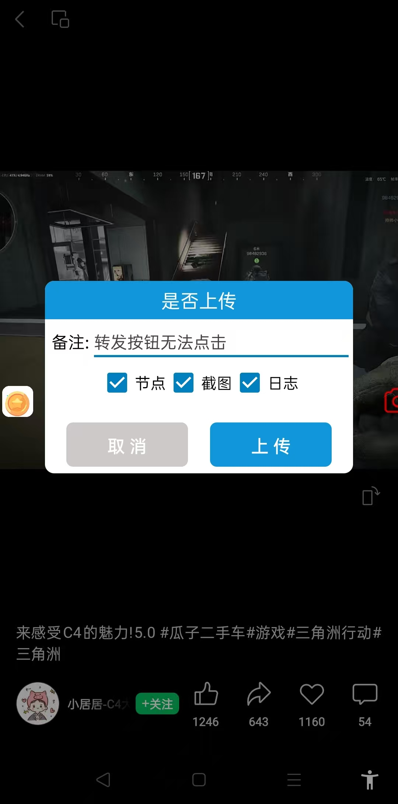

# 一、前提条件

- 综合脚本升级到111，单微脚本升级到95及以上版本
- 如果无法自动更新，请手动退出脚本再重新打开
- 开启无障碍和随选朗读

可以看到屏幕边缘吸附着一个绿色图标，如下图：

# 二、使用方法

## 1.点击绿色图标，从边缘弹出，显示整个图标

## 2.再次点击图标，使其变为红色（变成红色就不要点了）

## 3.等待大概1秒，会弹出上传窗口

## 4.上传

1. **上传时务必关闭日志悬浮窗**
2. 勾选三个选项。
3. 填写备注（也可不填）。
4. 点击上传。